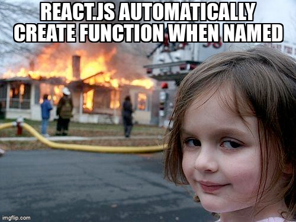

# react-quiz

## MaTS



---
## Chapter 1: What is React.js?

#### React is a JavaScript library for building user interfaces.
React has been designed from the start for gradual adoption, and **you can use as little or as much React as you need**.

### Chapter 1.1: Learn React

If you prefer to learn by doing, [click here](https://reactjs.org/tutorial/tutorial.html).  
If you prefer to learn concepts step by step, [click here](https://reactjs.org/docs/hello-world.html).

### Chapter 1.2: Example

For an ```Hello, world!``` the code in React would look like:
````javascript
const root = ReactDOM.createRoot(document.getElementById('root'));
root.render(<h1>Hello, world!</h1>);
````

### Chapter 1.3: Documentation

For the React documentation, [click here](https://reactjs.org/docs/getting-started.html)

---
## Chapter 2: The mission

We are going to try to make a quiz site / application that will be better than Kahoot!  
Starting with a simple react project we are going to keep adding layers of complexity 'till we have a super fun quiz to share with friends and family.

Now to make it a bit easier, instead of having the user create their own quizzes we are going to consume the [open trivia database](https://opentdb.com/).  
Here we can fetch multiple choice questions with possible answers! (And the correct one of course ;) )

---

## Chapter 3: Getting started
#### It is important to know that React works with components
→ The current React standard is functional components.  
I will be giving some examples further on.

### Chapter 3.1: Command to run React in your application

````
npx create-react-app kahoot-but-better
````

### Chapter 3.2: State

#### There are 3 things you should know about ```setState()```.

#### 1. Do not modify state directly

````javascript
// Wrong
this.state.comment = 'Hello';
````
Instead, use ```setState()```:
````
// Correct
this.setState({comment: 'Hello'});
````

#### The only place you can assign ```this.state()``` is in the constructor.

### 2. State updates may be asynchronous 

React may batch multiple ```setState()``` calls into a single update for performance.

Because ```this.props``` and ```this.state``` may be updated asynchronously, you should not rely on their values for calculating the next state.

For example, this code may fail to update the counter:

````javascript
// Wrong
this.setState({
  counter: this.state.counter + this.props.increment,
});
````

To fix it, use a second form of ```setState()``` that accepts a function rather than an object.  
That function will receive the previous state as the first argument, and the props at the time the update is applied as the second argument:

````javascript
// Correct
this.setState((state, props) => ({
  counter: state.counter + props.increment
}));
````

### 3. State updates are merged

When you call ```setState()```, React merges the object you provide into the current state.
For example, your state may contain several independent variables:

````javascript
  constructor(props) {
    super(props);
    this.state = {
      posts: [], 
      comments: []    
    };
  }
````

Then you can update them independently with separate ```setState()``` calls:

````javascript
  componentDidMount() {
    fetchPosts().then(response => {
      this.setState({
        posts: response.posts      });
    });

    fetchComments().then(response => {
      this.setState({
        comments: response.comments      });
    });
  }
````

The merging is shallow, so ```this.setState({comments})``` leaves ```this.state.posts``` intact, but completely replaces ```this.state.comments```.

### Chapter 3.3: Hooks

#### Hooks allow you to reuse stateful logic without changing your component hierarchy.

#### Chapter 3.3.1: Why we use hooks?